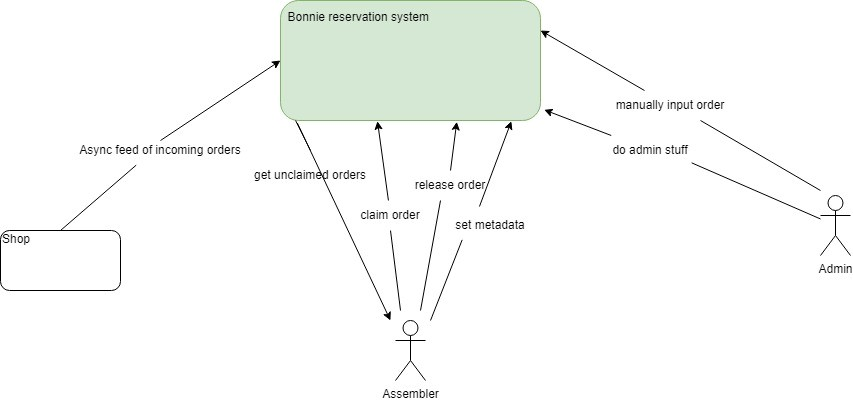

# Bonnie - The ultimate kit assemble management service

### Goal

There is a shop, which is selling different kits which can be ordered assembled or unassemled. Our service takes asyncronous orders from the shop. Every order contains the id of the product to order and the quantity of the products ordered.

Our service needs to provide some communication channels that the shop can use to place orders, and needs to provide information to the shop about the status of the placed orders and the trackingNr. if the order is shipped.

Those orders can then be claimed by an assembler, who assembles them. After the successful assemble the order is passed to the delivery company. The delivery company provides the trackingNr that is updated in Bonnie by the assigned assembler after the order handed to delivery.

Assemblers needs to be able claim unassigned orders, release them if neccessary, modify their status in the system, and provide trackingNr. from delivery company.

There needs to be an admin as well, who can place an order manually, and who can modify almost any data related to the system.

### Roles

* Assembler
* Admin

### Interactions by roles:

1. Assembler
   * getUnclaimedOrders
     (We need to keep track of orders and if they are already assigned to an assembler, so the free assemblers can easily pick from the unclaimed ones.)
   * getClaimedOrders
     (We need to provide a way to the assemblers to list the orders claimed by them, so they can update the status of them.)
   * AssignKitToAssembler
     (Assemblers needs to be able to claim a kit, so there won't be any conflicts during the assembling process.)
   * updateOrderStatus
     (Assemblers needs a way to update the status of the kit(s) claimed by them, so that the shop can be updated on the status of the order.)
   * updateTrackingNr
     (Assemblers needs a way to update the trackingNr. in the system after handing the order to the delivery company, so that the shop can still keep an eye on it)
2. Admin
   * createOrder
     (The admin need to be able to manually create an order)

### User Stories

**Shop**
As a shop I want to...

1. be able to make orders on preassembled goods, so that I can sell them to my customers.
2. be sure that the goods I ordered are managed correctly, so I need to be able to check the status of the orders by the Id of the order.
3. get noticed when an order is handed over to the shipping company by accessing it’s trackingNr., so that I can keep an eye on the order during delievery.

**Assembler**
As an assembler I want to be able to ...

1. get the list of orders I can assemble (unclaimed orders), so that I can pick one to work on it.
2. claim an order, so that I can be sure there is no other assembler working on the same order
3. release unfinished orders if I'm not capable of finishing it, so that others can claim it and complete the assemling process from the beginning (no progress in assemble, it's either not started or finished)
4. modify order status, so that the shop can keep track of that.
5. provide the trackingNr after giving an order to delivery company (should automatically set the status to shipped).

**Admin**
As an admin I want to be able to ...

1. manually create an order, so that I can create a new order if needed
2. modify any kind of data without using the application (the admin will have root access)
3. ~~make other users admin, so in case of an admin change, I can delegate the role~~
4. ~~modify non credential user data, so I can fix if there is some problem with it~~
5. ~~reassign/unassign an order, so if something happens to an assembler the process can still continue~~
6. ~~modify not shipped order based on id or tracking number, so I can fix if there is some problem in the data~~

### Possible improvements

* Give the assembler the shipping details only after a successful process.
* Provide the admin some new, fancy ways to manage data (like a UI)
